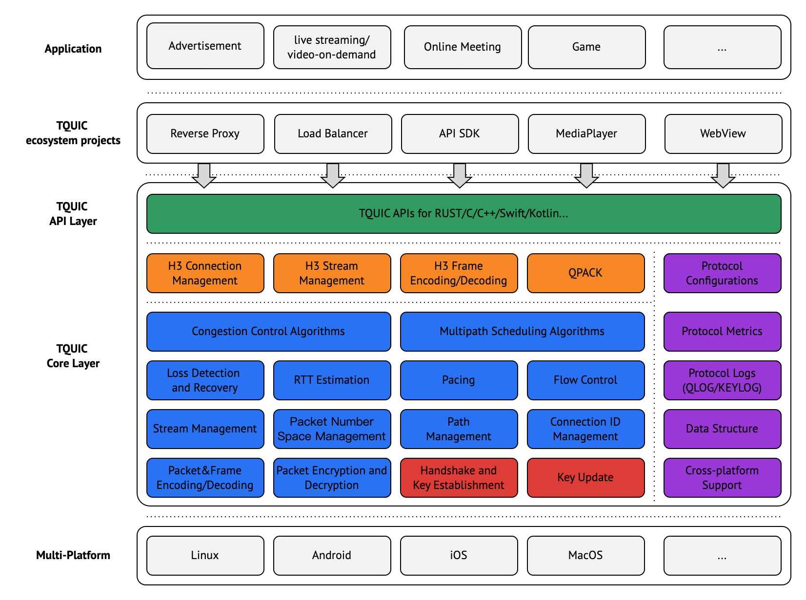

# Introduction

TQUIC is a QUIC protocol implementation written in the Rust language, aiming to create a low-overhead, high-throughput, and high-quality transport protocol library with continuous technological influence.

<!--truncate-->

# Why Open source?

QUIC is a new general-purpose, secured, multiplexed transport-layer protocol. It offers several enhancements, aiming to eventually replace TCP, which could enable Internet transport to continue evolving and solve many of the problems plaguing the Internet. 

With QUIC being chosen as the foundation for HTTP/3, it is reasonable to expect that the protocol will carry a growing share of Internet traffic.

Given QUIC's broad scope, long-term vision, and innovative nature, we have decided to release our TQUIC library as open-source. Our goal is to take this opportunity to collaborate with peers and further explore the emerging technologies in the transport layer.

# Features and Advantages

The advantages of TQUIC are as follows.	

**High Throughput**: TQUIC provides the most comprehensive collection of congestion control algorithms in the industry, consistently meeting RFC standards and outperforming [similar open-source projects](https://tquic.net/docs/further_readings/comparison/) by 2%-30% in certain scenarios such as poor networks.

**High performance**: The performance of TQUIC surpasses that of [similar open-source projects](https://tquic.net/docs/further_readings/benchmark) by 5% and 20% in most and certain scenarios respectively.

**High Quality**: The QUIC protocol stack comprises over 10 core RFC standards or drafts, covering the transport layer, security layer, and application layer. It is considerably more complex compared to TCP. TQUIC has achieved an impressive unit test coverage of over 95% and has successfully passed interoperability tests with four leading QUIC implementations in the industry. Additionally, a rigorous test method based on formal specifications (SIGCOMM2019 paper) is employed to ensure strict protocol conformance.

**Easy to Use**: TQUIC is not only easy to use, but also supports flexible configuration and detailed observability. In addition, it offers APIs for Rust/C/C++, with plans to  expand its support to Kotlin/Swift, etc.

**Powered by Rust**: TQUIC is written in a memory-safe language, making it immune to Buffer Overflow vulnerability and other memory-related bugs.

**Rich Features**: TQUIC supports all major features as specified in the QUIC and HTTP/3 RFCs.

[The TQUIC project website](https://tquic.net/docs/intro) offers a comprehensive introduction to TQUIC.

# Architecture

The Figure shown below illustrates the architecture of TQUIC.

TQUIC was built with a focus on working across different platforms and supporting various concurrency models. Its core employs an abstraction design for network I/O and event loop. It relies on callbacks provided by users rather than sockets. Furthermore, it doesn't impose specific event loop requirements, but offers functions to assist users in scheduling events. This flexibility makes TQUIC easy to customize and integrate.

The TQUIC API layer provides user-friendly interfaces for various programming languages on different mainstream platforms. It provides both sync and async interfaces, works well with different concurrency models, and improves user experience.

# Roadmap

* Integrating open-source ecosystem projects, expanding TQUIC application scenarios, and further enhancing user experience with TQUIC
* Publishing relevant papers and gradually releasing more advanced TQUIC features and algorithms as open-source
* Tracking the evolution and innovation of the QUIC protocol, while continuously enhancing the core capabilities of TQUIC

# Conclusion

The open source of TQUIC is just the beginning. We welcome suggestions from all parties and encourage involvement in the advancement of the ecology of transport technology. Interested parties are welcome to reach out and engage with us.

