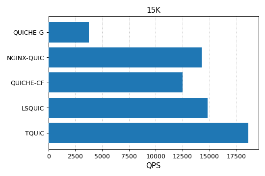
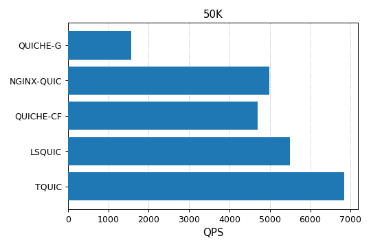
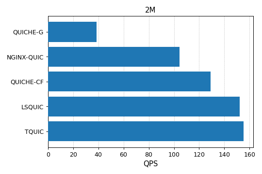
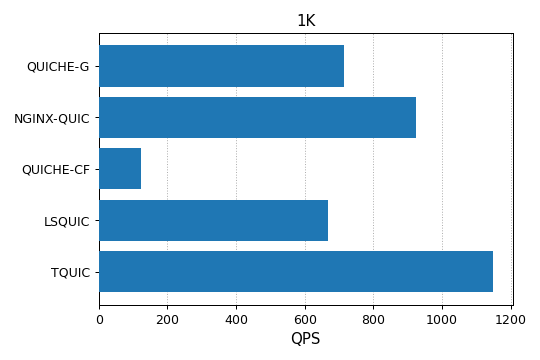

# Performance benchmarking

## Methods for testing

The purpose of this document is to evaluate the performance of the TQUIC library and compare it with that of several widely used [QUIC implementations](comparison.md).
It is important to note that there are numerous QUIC implementations currently available in the industry. However, we only selected some of them for comparison. The primary reasons for our choices are detailed in [this article](./comparison.md).

### Testbed

The detailed parameters of the test machine are as follows. Both the client and server programs are deployed on the same machine, but assigned to different CPU cores in order to prevent interference. The deployment allows for easy automation of benchmarking.

| Category | Description |
| -------- | ----------- |
| CPU | AMD EPYC 7K62 48-Core |
| Memory | 512G |
| Disk | SSSTC ER2-GD480 |
| OS | Linux 4.14 |

**Server-side Setup**: The server example programs from each QUIC implementation are chosen for testing, using the most recent stable version, as described below.

| Core Maintainers | QUIC Implementations |
| ---------------- | -------------------- |
| Google     | QUICHE-G [v118.0.5983.1](https://chromium.googlesource.com/chromium/src.git/+/refs/tags/118.0.5983.1) |
| Nginx      | NGINX-QUIC [v1.25.2](http://nginx.org/en/download.html) |
| Cloudflare | QUICHE-CF [v0.18.0](https://github.com/cloudflare/quiche/releases/tag/0.18.0) |
| LiteSpeed  | LSQUIC [v4.0.1](https://github.com/litespeedtech/lsquic/releases/tag/v4.0.1) |

The application logic of each server program is simplified to reflect the actual processing overhead of the QUIC stack as closely as possible. For example, the server program from LSQUIC uses regular expressions to extract the file path from the request, which introduces certain performance overhead. Therefore, we have opted to replace the regular expression matching with simple string matching.

Each server program is compiled in release mode and configured to run in single-thread mode. For detailed configuration parameters, please refer to the [Appendix](benchmark.md#appendix).


**Client-side Setup**: The [TQUIC client](https://github.com/tencent/tquic/tools/src/bin/tquic_client.rs) is used as a stress testing tool due to its highly flexible parameters, and support for multiple threads, which helps increase the pressure to a test server.


### Scenarios tested

The application layer protocol used for testing was HTTP/3, while various typical scenarios were tested, including web browsing, image loading, and video playback. We conducted tests in both long connection and short connection scenarios. 

- **Long connection scenario**: The purpose of the scenario is to test the protocol stack's capacity for handling requests by constantly sending multiple requests per connection. The selected sizes of page, image, and video files were 5KB, 15KB, and 2MB respectively according to the median statistics from the [HTTP Archive](https://httparchive.org/reports/page-weight#bytesHtml).

- **Short connection scenario**: The purpose of the scenario is to test the protocol stack's capacity for handshake by sending only one request per connection. Additionally, we intentionally selected a relatively small response size of 1KB.

The RPS (number of successful requests per second) of each implementation is compared under extreme pressure, while all implementations achieve a maximum CPU utilization rate of 100% (unless otherwise noted).

:::note
The future work may involve the addition of more complex test scenarios.
:::

## Results

### Long connection scenario
As shown below, TQUIC outperforms the other implementations under various conditions. For example, TQUIC is four to five times faster than the most widely used QUICHE-G; 
The performance of TQUIC consistently surpasses that of LSQUIC under various conditions, by up to 20%, despite the fact that LSQUIC is written in C and considered the best performing among these alternative implementations.






### Short connection scenario

TQUIC outperforms the other implementations by at least 20% in the short connection scenario, as shown in the figure below.
Note that the CPU consumption of QUICHE-G and LSQUIC is 30% and 60%, respectively, and the CPU consumption of the other implementations is 100%.




## Appendix

### Server configurations

**QUICHE-G**
```
./quic_server --port=${port} --quic_response_cache_dir=${file_dir} \
     --certificate_file=server.crt --key_file=server.pkcs8
```

**NGINX-QUIC**
```
events {
    worker_connections 100000;
}

http {
    access_log off;
    server {
        listen ${port} quic reuseport;
        keepalive_requests 1000000;
        ssl_certificate server.crt;
        ssl_certificate_key server.key;
        ssl_protocols TLSv1 TLSv1.1 TLSv1.2 TLSv1.3;
        root ${file_dir};
    }
}
```

**QUICHE-CF**
```
./quiche-server --listen [::]:${port} --root ${file_dir} \
    --cert server.crt --key server.key --disable-gso --no-retry
```


**LSQUIC**
```
./http_server -c example.org,server.crt,server.key -s 0.0.0.0:${port} -r ${file_dir}
```

**TQUIC**
```
./server  -l 0.0.0.0:${port} --log-level OFF --root ${file_dir} -c server.crt -k server.key
```
     

### Client configurations

The command for stress tests is as follows:
```
./client -p --max-requests-per-thread 0 --log-level OFF --disable-stateless-reset \
    --threads ${threads} \
    --max-concurrent-conns ${max_concurrent_conns} \
    --max-requests-per-conn ${max_requests_per_conn} \
    --max-concurrent-requests ${max_concurrent_requests} \
    --send-udp-payload-size ${send_udp_payload_size} \
    --duration ${duration} \
    --handshake-timeout ${handshake_timeout} \
    --idle-timeout ${idle_timeout} \
    https://${host}:${port}/${file}
```

The parameters' meanings are as follows:
- **threads**: The number of threads to use.
- **max_concurrent_conns**: The number of concurrent connections maintained per thread.
- **max_requests_per_conn**: The maximum number of requests per connection. 0 means no limit.
- **max_concurrent_requests**: The number of concurrent streams per connection.
- **recv_udp_payload_size**: Specify the `max_udp_payload_size` transport parameter. The value for the tests is 1350.
- **duration**：The duration for testing.
- **handshake_timeout**: The handshake timeout. The value for the tests is 5 seconds.
- **idle_timeout**：The connection idle timeout. The value for the tests is 5 seconds.
- **host**：The listening address for the server.
- **port**：The listening port for the server.
- **file**：The requested resource by the client.

