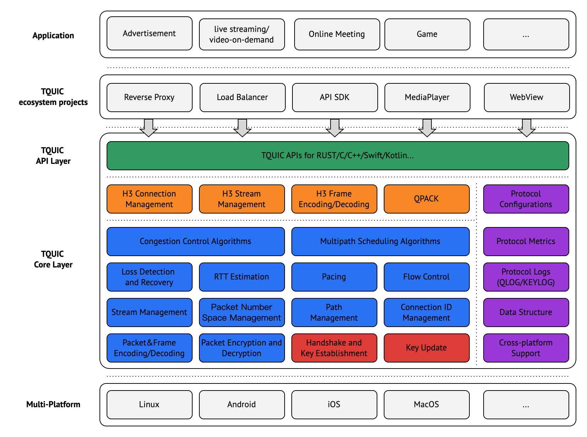

# 项目介绍

TQUIC是基于RUST语言开发的QUIC协议库，目标是打造一个具有持续技术影响力，高性能、快传输、高质量的传输协议库。

<!--truncate-->

# 开源缘起

QUIC是一种新的通用、安全、多路复用的传输层协议，提供了大量增强功能并旨在最终取代TCP，从而推动互联网传输继续发展并解决困扰互联网的许多问题。

随着QUIC被选为HTTP/3的底层传输协议，预计QUIC协议将占据更大的互联网流量份额，并持续使用至少30年以上。

由于QUIC所具备的广泛性、长期性、创新性特点，我们开源了自研的TQUIC协议库，希望能借TQUIC开源的机会, 与各位同行切磋技术，促进传输层技术的发展。

# 特性和优势

TQUIC协议库具有如下的优势：

**快传输**：TQUIC是业界支持拥塞控制算法最丰富的协议库，在全部场景下表现符合RFC预期，在部分场景例如弱网环境下传输效果领先[同类开源产品](https://tquic.net/zh/docs/further_readings/comparison) 2%-30%。

**高性能**：TQUIC在大部分测试场景下的单机处理性能优于[同类开源产品](https://tquic.net/zh/docs/further_readings/benchmark) 5%，部分场景下单机处理性能领先20%。

**高质量**：QUIC 协议栈涵盖10+篇核心的RFC标准或草案，同时涉及到传输层、安全层、应用层，复杂度远大于TCP。TQUIC单元测试覆盖率95%以上，与业界四个主流 QUIC实现的互操性测试用例通过率为100%， 同时采用基于形式化规范(SIGCOMM2019论文成果）的测试方法，严格保障了协议一致性。

**易用性**：TQUIC易于使用，支持灵活的配置和丰富的可观察性；TQUIC提供了Rust/C/C++多语言接口，未来计划进一步提供Kotlin/Swift等语言接口。

**基于RUST**：TQUIC基于内存安全语言编写，不受缓冲区溢出漏洞和其他与内存相关缺陷影响。

**丰富特性**： TQUIC支持所有QUIC和HTTP/3规范的重要特性。

关于TQUIC的详细介绍可以查看TQUIC项目网站 https://tquic.net/zh/docs/intro 。

# 项目架构

TQUIC项目架构图如下所示。

TQUIC将跨平台兼容及多并发模型支持作为关键的设计目标。TQUIC核心采用了网络IO及事件循环抽象化设计。TQUIC核心并不依赖于套接字，而是通过用户提供的回调来实现。同时，TQUIC核心没有强加特定的事件循环要求，它提供了帮助用户调度事件的函数。TQUIC的灵活性使得易于在各种系统中的定制和集成。

TQUIC接口层提供了面向主流平台编程语言的高层级封装接口，支持同步、异步语义接口，兼容不同的并发模型，并简化用户的使用。

# 后续规划

* 对接开源技术生态，扩大TQUIC使用场景，进一步提升TQUIC使用体验。
* 发表相关论文，并逐步开源更多TQUIC高级特性和算法。
* 追踪QUIC协议的演进和创新，并持续提升TQUIC核心能力。

# 结语

TQUIC的开源只是开始。期待得到大家的指正，并能参与进来，共同建设网络传输领域的技术生态。欢迎有兴趣的同学和我们联系。

