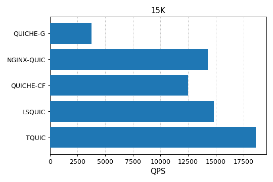
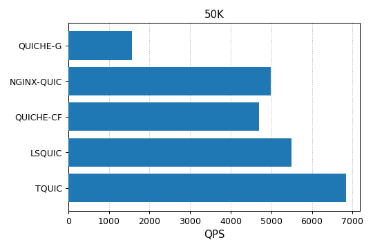
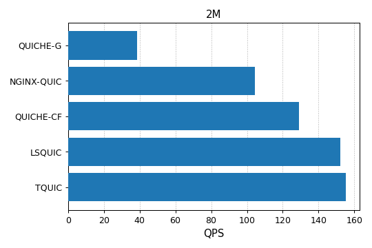
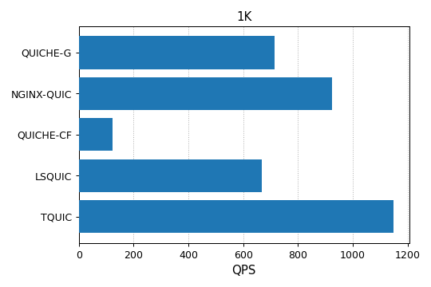

# 性能测试

## 测试方法

本文测试了TQUIC协议库的性能，并与一些广泛使用的[QUIC协议实现](comparison.md)进行了比较。需要注意的是，业界目前包括很多的QUIC实现。但是我们只选取了其中部分进行比较。我们选择的依据可以参考[这篇文章](comparison.md)。


### 测试环境

测试服务器详细参数如下。其中测试客户端与测试服务端部署在相同机器上，客户端与服务端分别绑定到不同CPU核以避免影响。采用这种部署方式，可以简单方便的实现自动化的性能测试。

| 类别 | 说明 |
| ---- | ---- |
| 处理器 | AMD EPYC 7K62 48-Core |
| 内存 | 512G |
| 磁盘 | SSSTC ER2-GD480 |
| 操作系统 | Linux 4.14 |


**服务端**：我们基于各QUIC实现提供的服务端示例程序进行测试，并采用了最近的稳定版本，具体信息如下所示。

| 主要维护者 | QUIC实现 |
| ---------- | -------- |
| Google     | QUICHE-G [v118.0.5983.1](https://chromium.googlesource.com/chromium/src.git/+/refs/tags/118.0.5983.1) |
| Nginx      | NGINX-QUIC [v1.25.2](http://nginx.org/en/download.html) |
| Cloudflare | QUICHE-CF [v0.18.0](https://github.com/cloudflare/quiche/releases/tag/0.18.0) |
| LiteSpeed  | LSQUIC [v4.0.1](https://github.com/litespeedtech/lsquic/releases/tag/v4.0.1) |

各服务端示例程序的应用逻辑足够简单，以便尽量真实反映QUIC协议栈的处理开销。例如，LSQUIC服务端程序使用了正则表达式来从请求中提取文件路径，这会引入了一定的性能开销。因此，我们将正则表达式匹配替换为了简单的字符串匹配。

各服务端程序编译时使用发布模式，并配置为采用单线程模式运行，具体配置参数参见[附录](benchmark.md#appendix)。


**客户端**：我们使用TQUIC[客户端](https://github.com/tencent/tquic/tools/src/bin/tquic_client.rs)作为压测客户端，它具有非常灵活的参数，并支持使用多个线程来增加请求压力。


### 测试场景

我们使用的应用层协议是HTTP/3，并对一些典型应用场景（包括网页浏览、图片加载、视频播放）进行了测试。我们区分长连接与短连接场景进行测试。

- **长连接场景**：在长连接场景中，每个连接会持续发送多个请求，用于评估协议栈在处理请求方面的极限能力。根据[HTTP Archive](https://httparchive.org/reports/page-weight#bytesHtml)统计数据的中位数，我们选择的网页文件大小是5KB、图片大小是15KB、视频文件大小是2MB。

- **短连接场景**：在短连接场景中，每个连接仅发送一个请求，用于评估协议栈在处理握手方面的极限能力。同时，我们选择了非常小响应大小（1KB）。

我们对各实现在极限性能下的每秒成功处理的请求数（RPS）进行比较，各实现的CPU使用率均达到100%（除非另有说明）。

:::note
在后续版本中，可能会进一步增加更复杂的测试场景。
:::


## 测试结果及分析

### 长连接场景

如下图所示，TQUIC在各情况下均优于其他实现。例如，在不同文件大小情况下，TQUIC的性能是使用最广泛的QUICHE-G的4~5倍；
与这些实现中用C语言编写且性能最好的LSQUIC相比，TQUIC在各条件下均优于LSQUIC，最高达20%。






### 短连接场景

短连接场景下，TQUIC领先其他实现至少20%，详细结果如下图所示。
注意该场景下，QUICHE-CF与LSQUIC的CPU消耗分别是30%与60%，其它实现的CPU消耗是100%。




## 附录

### 服务端配置参数

**QUICHE-G**
```
./quic_server --port=${port} --quic_response_cache_dir=${file_dir} \
     --certificate_file=server.crt --key_file=server.pkcs8
```

**NGINX-QUIC**
```
events {
    worker_connections  100000;
}

http {
    access_log off;
    server {
        listen ${port} quic reuseport;
        keepalive_requests 1000000;
        ssl_certificate      server.crt;
        ssl_certificate_key  server.key;
        ssl_protocols TLSv1 TLSv1.1 TLSv1.2 TLSv1.3;
        root ${file_dir};
    }
}
```

**QUICHE-CF**
```
./quiche-server --listen [::]:${port} --root ${file_dir} \
    --cert server.crt --key server.key --disable-gso --no-retry
```

**LSQUIC**
```
./http_server -c example.org,server.crt,server.key -s 0.0.0.0:${port} -r ${file_dir}
```

**TQUIC**
```
./server  -l 0.0.0.0:${port} --log-level OFF --root ${file_dir} -c server.crt -k server.key 
```

### 客户端配置参数

客户端执行压力测试的命令如下：
```
./client -p --max-requests-per-thread 0 --log-level OFF --disable-stateless-reset \
    --threads ${threads} \
    --max-concurrent-conns ${max_concurrent_conns} \
    --max-requests-per-conn ${max_requests_per_conn} \
    --max-concurrent-requests ${max_concurrent_requests} \
    --send-udp-payload-size ${send_udp_payload_size} \
    --duration ${duration} \
    --handshake-timeout ${handshake_timeout} \
    --idle-timeout ${idle_timeout} \
    https://${host}:${port}/${file}
```

各个参数的含义如下：
- **threads**：客户端使用的线程数
- **max_concurrent_conns**：每线程维持的并发连接数
- **max_requests_per_conn**：每连接发送的最大请求数，0表示没有限制
- **max_concurrent_requests**：每连接使用的并发流数
- **recv_udp_payload_size**：设置`max_udp_payload_size`传输参数，测试中设置为1350
- **duration**：压测持续时间
- **handshake_timeout**：握手超时时间，设置为5秒
- **idle_timeout**：连接闲置超时时间，设置为5秒
- **host**：服务端监听地址
- **port**：服务端监听端口
- **file**：客户端请求的文件

